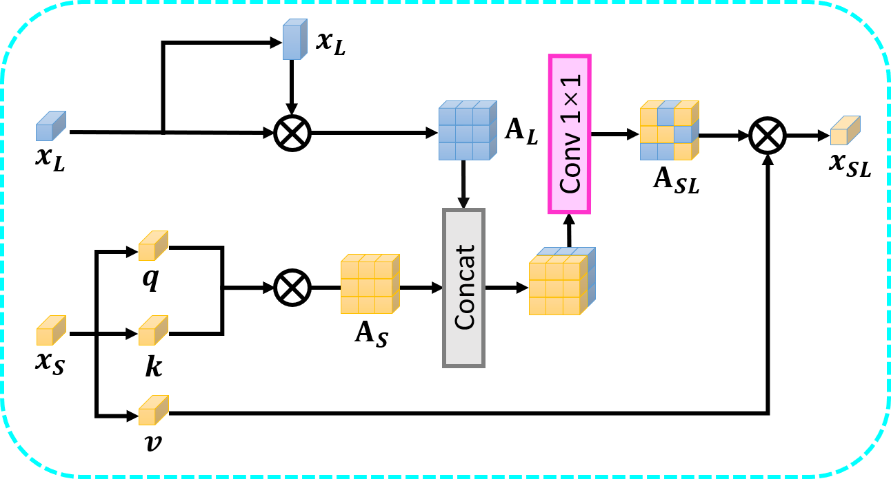
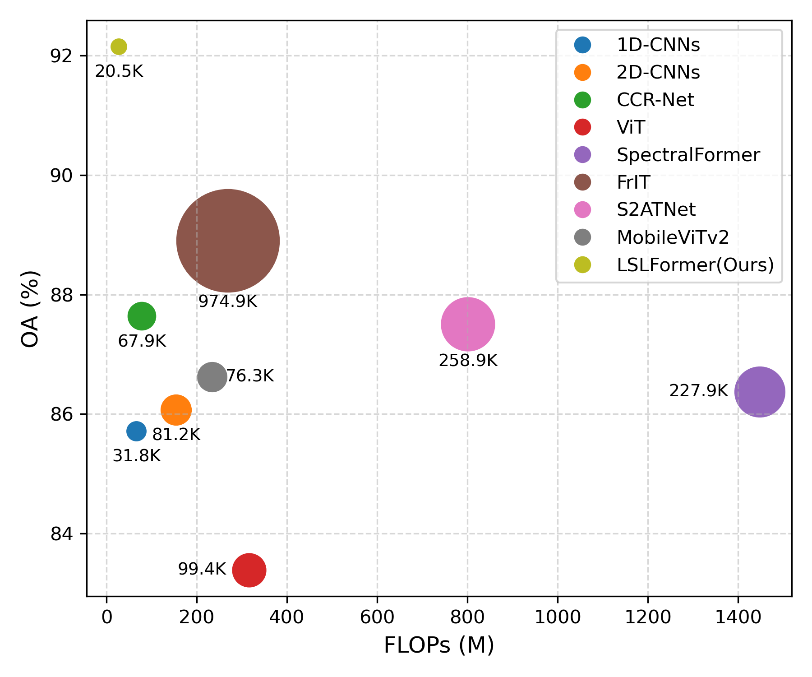

<div align="center">

# LSLFormer: A Lightweight Spectral-LiDAR Fusion Network
### for Remote Sensing Image Classification

[](https://doi.org/10.1109/TGRS.2026.3654154)
[](https://opensource.org/licenses/MIT)

**Dian Li, Siyuan Hao, Cheng Fang, Yuanxin Ye**  
*IEEE Transactions on Geoscience and Remote Sensing (TGRS), 2026*

</div>

---

## 📸 Overview

<p align="center">
  
  <br/>
  <b>An overview illustration of the proposed Lightweight Spectral-LiDAR Fusion Network</b>
</p>

---

## 🧠 Method Highlights

<table align="center">
  <tr>
    <td align="center" width="50%">
      
      <br>
      <b>🔬 Detailed structure of Spectral-LiDAR Attention</b>
    </td>
    <td align="center" width="50%">
      
      <br>
      <b>📊 Computation cost & Overall Accuracy of different methods</b>
    </td>
  </tr>
</table>

---

## 📦 Dataset

The **Houston2013** dataset used in our experiments can be downloaded from:

| Platform | Link | Access |
|----------|------|--------|
| Google Drive | [Download](https://drive.google.com/drive/folders/1Op5O5UhlPWZK6ng9IYT1MzBftsool7jt?usp=drive_link) | Public |
| BaiduYun | [Download](https://pan.baidu.com/s/1T5m8ADyHL0gSkzIh8bp8dg) | Code: `f391` |

---

## 🚀 Usage

### Train the model

```bash
python train.py \
    --patches=7 \
    --band_patches=3 \
    --weight_decay=5e-3 \
    --dataset='houston2013' \
    --flag_test='train'
```

### Teast the model

```bash
python train.py \
    --patches=7 \
    --band_patches=3 \
    --weight_decay=5e-3 \
    --dataset='houston2013' \
    --flag_test='test'
```

##📖 Citation
```
Please kindly cite the papers if this code is useful and helpful for your research.
```

```bibtex
@ARTICLE{11352989,
  author={Li, Dian and Hao, Siyuan and Fang, Cheng and Ye, Yuanxin},
  journal={IEEE Transactions on Geoscience and Remote Sensing}, 
  title={LSLFormer: A Lightweight Spectral–LiDAR Fusion Network for Remote Sensing Image Classification}, 
  year={2026},
  volume={64},
  number={},
  pages={1-12},
  doi={10.1109/TGRS.2026.3654154}
}
```


##📄 License
```
This project is released under the MIT License.
```

<div align="center"> <sub>⭐ If you like our work, please consider giving this repository a star!</sub> </div> 
